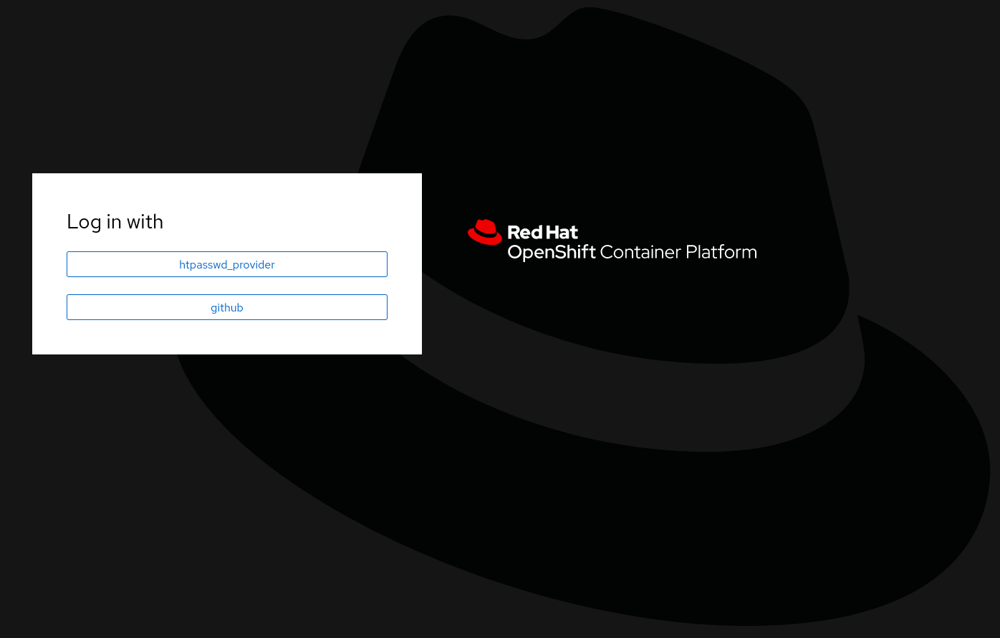
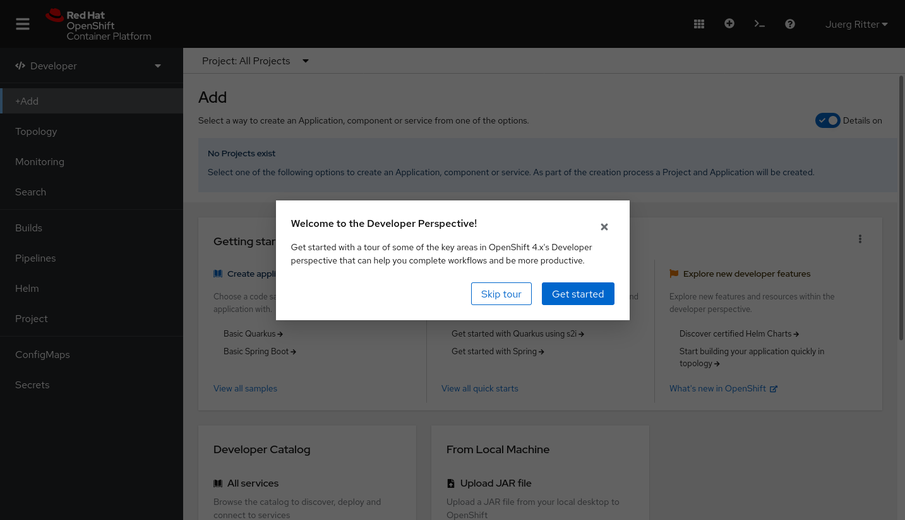
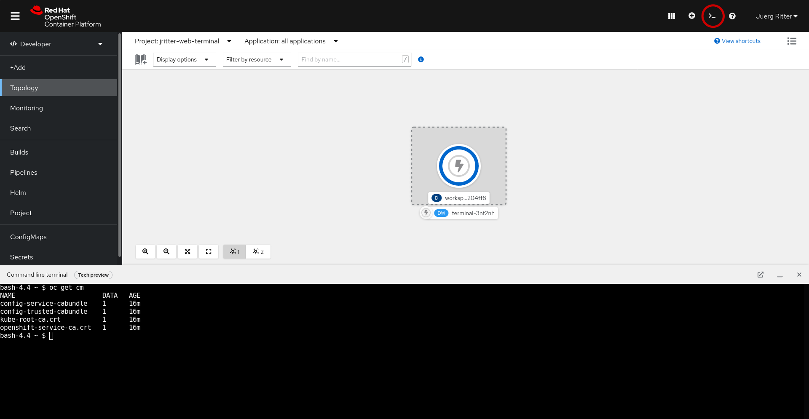
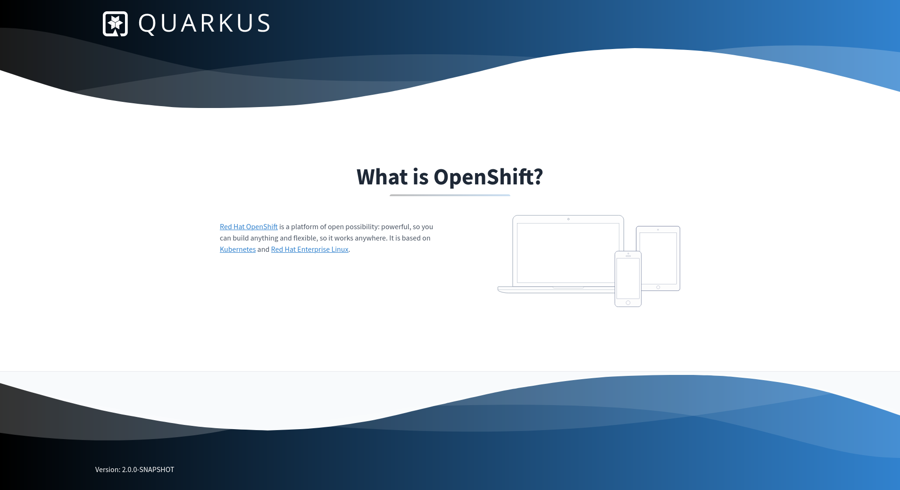

# OpenShift Pipelines Workshop Instructions

Welcome to the OpenShift Pipelines Workshop! Here you'll find all the necessary instructions for the hands-on session for this workshop.

## What is it?

This repository contains instructions which are part of a taught workshop on [Tekton](https://tekton.dev) and [OpenShift Pipelines](https://cloud.redhat.com/learn/topics/ci-cd). It is based on OpenShift 4.8 and OpenShift Pipelines 1.5. 

## What you need before getting started

- A notebook with a browser
- OpenShift 4.8 Cluster with OpenShift Pipelines Operator installed. This will be provided for the students in the lecture.
- [GitHub](https://github.com/) Account
- For students: Please ask your teacher to add your account to the [openshift-pipeline-workshop](https://github.com/openshift-pipeline-workshop) organisation. This allows you to log into the OpenShift Cluster using the GitHub account.
- OPTIONAL: Install command line clients (Available for Linux, Mac and Windows)
    - [oc](http://mirror.openshift.com/pub/openshift-v4/x86_64/clients/ocp/stable/)
    - [tkn](http://mirror.openshift.com/pub/openshift-v4/x86_64/clients/pipeline/latest/)
    - [helm](http://mirror.openshift.com/pub/openshift-v4/x86_64/clients/helm/latest/)
- OPTIONAL: Install [Java JDK 11+](https://adoptopenjdk.net/) and [Apache Maven 3.8.1+](https://maven.apache.org/) if you want to try to build the sample application on your computer.

## First Steps in OpenShift

### Web Console

Let's briefly explore the environment we are working with. In your browser, please navigate to the OpenShift Web Console URL. In a taught session, the instructor will provide you the link. You should see something like this:



Please choose "github", and you'll be redirected to GitHub. You'll be asked to grant permissions to this OpenShift App, and then redirected back to OpenShift, which should present a Get started screen similar to this:



Feel free to take the get started tour if you want!

### Command Line

In case you want to use the command line client, you can obtain a token by clicking on your Name on the top right of the OpenShift Web Console, and then choose "Copy login command". In the window popping up, please choose again "github" if prompted, and then copy & paste the login command into the terminal application of your computer. The login command should look something like this, of course the token and the API URL will be different.

```
$ oc login --token=sha256~XXXXX --server=https://api.cluster.openshift.com:6443
```


### OpenShift Web Command Line Terminal

In case you don't have the command line tool installed, but you still want to use the command line, you can use the web command line terminal from within the OpenShift Web Console. This gives you access to command line tools such as oc, kubectl, tkn, helm, git, etc. through the web browser, no local installation is required.

To get started with this feature, create a project by clicking on the drop down that says "Project: All Projects" and then "Create Project". In the following popup, specify a project name. Since you are using a shared cluster and project names need to be unique across the cluster, please prefix it with your github user name to avoid naming collisions. The name of the project can be anything as long as it is unique, but let's call it `<github_username>-web-terminal`.

After that, you can click on the web terminal icon on the top right next to your name. When launching it the first time, you will be prompted for a project. There, you can select the project you just created. After initializing for a couple seconds, you should be able to use the terminal.



Please note that whatever you save within on this web terminal session is volatile and will be lost when the terminal session terminates.

General Note: Please make sure that you get the command line tools working, either by installing them on your local computer, or via the web terminal. The instructions will rely on the use of the command line, simply because it is possible to be much more precise compared to guiding through the web console. All the instructions should be doable soley by using the OpenShift Web Console, but it won't be outlined in these instruction. The OpenShift Web Console is a great tool for observing what's going on, observing pipelines, pods, deployments, etc.


## Getting Familiar with the Demo App

As a demo application, we will use a very simple Application called color-service, which implements a configurable REST API and shiny frontend which reflects the response of the API. The color-service application is based on [Quarkus 2.1.0](https://quarkus.io/).

The application can be found in [this GitHub Repository](https://github.com/openshift-pipeline-workshop/color-service.git)

You will fork this application, and then build and deploy a container image using Tekton. But for now, we will see how the application looks like. A prebuilt image can be found here:

quay.io/jritter/color-service:2.0.0

Let's deploy the application on the openshift cluster:

```
$ oc new-project $(oc whoami)-color-service-explore
$ oc new-app --docker-image=quay.io/jritter/color-service:2.0.0 COLOR_SERVICE_COLOR=blue
$ oc expose service/color-service
```

Just like that, you deployed the application and it should now be accessible. In order to find out the URL, please run the following command:

```
$ echo http://$(oc get route color-service -o jsonpath={'.spec.host'})
```

When accessing the URL in the browser, you should see something like this:




Also, you should now see one pod running:

```
$ oc get pods
NAME                             READY   STATUS    RESTARTS   AGE
color-service-7849f456b5-nj6b2   1/1     Running   0          4m12s
```

The color that is returned by the color service can be changed by modifying the `COLOR_SERVICE_COLOR` environment variable, which we specified to be blue when deploying the application. If we want to change the color to green, we can modify the deployment as follows:

```
$ oc set env deployment color-service COLOR_SERVICE_COLOR=green
```

After updating the deployment, you should see a new pod spinning up, and the old one disappearing:

```
$ oc get pods
NAME                             READY   STATUS        RESTARTS   AGE
color-service-5488c9ccc4-6w848   1/1     Running       0          4s
color-service-7849f456b5-nj6b2   1/1     Terminating   0          7m36s
```

After a couple seconds, the website should switch to green automatically.

The color-service can serve the following colors:
- red
- green
- blue
- yellow


Feel free to play around with these colors if you feel like it. The environment variable can also be set by directly modifying the deployment resource:

```
$ oc edit deployment color-service
```

## Getting Started with Tekton

Remember that the foundation of Tekton consists of two Resource types. Tasks, and Pipelines which form a collection of Tasks. Tasks and Pipelines can be started by creating TaskRun and PipelineRun resources. Since we just created the namespace, the only thing we can start at this point are cluster tasks, which we can explore as follows:

```
$ tkn clustertask list
NAME                       DESCRIPTION              AGE
buildah                    Buildah task builds...   2 days ago
buildah-1-5-0              Buildah task builds...   2 days ago
echo                       This Task can be us...   13 minutes ago
git-cli                    This task can be us...   2 days ago
git-clone                  These Tasks are Git...   2 days ago
git-clone-1-5-0            These Tasks are Git...   2 days ago
...
```

ClusterTasks are not namespaced, and available to use in the whole cluster. If you have tasks which will be reused in the whole organization, it makes sense to define such a task as ClusterTask so it can be used in the whole cluster.

Let's have a closer look ath the echo task:

```
$ $ tkn clustertask describe echo
Name:          echo
Description:   This Task can be used to run a Maven build.

📨 Input Resources

 No input resources

📡 Output Resources

 No output resources

⚓ Params

 NAME        TYPE     DESCRIPTION            DEFAULT VALUE
 ∙ MESSAGE   string   Message to be echoed   Meawwwwwww 😺

📝 Results

 No results

📂 Workspaces

 No workspaces

🦶 Steps

 ∙ echo

🗂  Taskruns

 No taskruns
```

This is a very simple task, which just outputs a message which can be passed in as a parameter called MESSAGE. It even has a default value, so we can just start the task:

```
$ tkn clustertask start echo
? Value for param `MESSAGE` of type `string`? (Default is `Meawwwwwww 😺`) Meawwwwwww 😺
TaskRun started: echo-run-s6nm4

In order to track the TaskRun progress run:
tkn taskrun logs echo-run-s6nm4 -f
```

The task has now started. In order to access the logs, use the command which is provided in the output of the previous command, which is different compared to this example.

```
$ tkn taskrun logs echo-run-s6nm4 -f
[echo] Meawwwwwww 😺
[echo] + echo Meawwwwwww $'\360\237\230\272'
```

If we want to pass in another message we can do this as follows:

```
$ tkn clustertask start echo -p "MESSAGE=Hello Tekton"
```
We can also explore previous runs of the tasks by runnning

```
$ tkn taskrun list
NAME             STARTED         DURATION    STATUS
echo-run-tqb2h   1 minute ago    7 seconds   Succeeded
echo-run-s6nm4   9 minutes ago   7 seconds   Succeeded
```

We can even dig deeper into these runs:

```
$ tkn taskrun describe echo-run-tqb2h
Name:              echo-run-tqb2h
Namespace:         jritter-web-terminal
Task Ref:          echo
Service Account:   pipeline
Timeout:           1h0m0s
Labels:
 app.kubernetes.io/managed-by=tekton-pipelines
 tekton.dev/clusterTask=echo

🌡️  Status

STARTED         DURATION    STATUS
3 minutes ago   7 seconds   Succeeded

📨 Input Resources

 No input resources

📡 Output Resources

 No output resources

⚓ Params

 NAME        VALUE
 ∙ MESSAGE   Hello Tekton

📝 Results

 No results

📂 Workspaces

 No workspaces

🦶 Steps

 NAME     STATUS
 ∙ echo   Completed

🚗 Sidecars

No sidecars
```

Tasks, ClusterTasks and TaskRuns can also be observed in the OpenShift Web Console. Can you figure out where and how?


