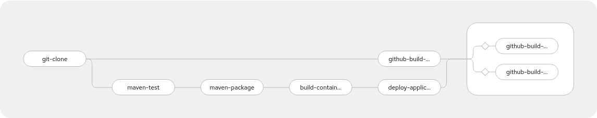
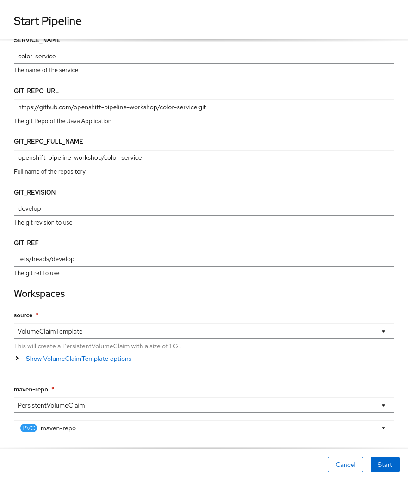
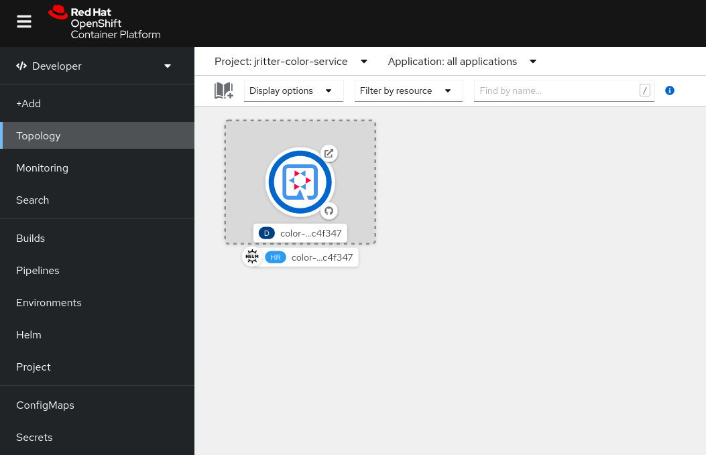
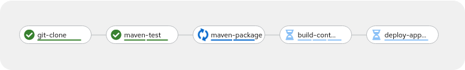

# OpenShift Pipelines Workshop Instructions

Welcome to the OpenShift Pipelines Workshop! Here you'll find all the necessary instructions for the hands-on session for this workshop.

## What is it?

This repository contains instructions which are part of a taught workshop on [Tekton](https://tekton.dev) and [OpenShift Pipelines](https://cloud.redhat.com/learn/topics/ci-cd). It is based on OpenShift 4.8 and OpenShift Pipelines 1.5. 

## How you should approach it

After getting up to speed with the exercise environment and Tekton itself, you'll be challenged by implementing tasks, modifying pipeline, and figuring stuff out. Possible solutions are available in the [solution](resources/solution) directory of this repository. You are encouraged tough to find solutions on your own, by looking at examples, reading the documentation, or talking to your peers or instructor. Look at the solution if you are really stuck, or to compare it with your own solution (which is probably a good one too!). If things are unclear, the instructor will be happy to help out. Getting the hands dirty and try things out is one of the most effective ways to learn new things.

## What you need before getting started

- A notebook with a browser
- Some basic understanding of container technology, Git and Kubernetes
- OpenShift 4.8 Cluster with OpenShift Pipelines Operator installed. This will be provided for the students in the lecture.
- [GitHub](https://github.com/) Account
- For students: Please ask your teacher to add your account to the [openshift-pipeline-workshop](https://github.com/openshift-pipeline-workshop) organisation. This allows you to log into the OpenShift Cluster using the GitHub account.
- OPTIONAL: Install command line clients (Available for Linux, Mac and Windows)
    - [oc](http://mirror.openshift.com/pub/openshift-v4/x86_64/clients/ocp/stable/)
    - [tkn](http://mirror.openshift.com/pub/openshift-v4/x86_64/clients/pipeline/latest/)
    - [helm](http://mirror.openshift.com/pub/openshift-v4/x86_64/clients/helm/latest/)
- OPTIONAL: Install [Java JDK 11+](https://adoptopenjdk.net/) and [Apache Maven 3.8.1+](https://maven.apache.org/) if you want to try to build the sample application on your computer.

## First Steps in OpenShift

### Web Console

Let's briefly explore the environment we are working with. In your browser, please navigate to the OpenShift Web Console URL. In a taught session, the instructor will provide you the link. You should see something like this:


Please choose "github", and you'll be redirected to GitHub. You'll be asked to grant permissions to this OpenShift App, and then redirected back to OpenShift, which should present a Get started screen similar to this:


Feel free to take the get started tour if you want!

### Command Line

In case you want to use the command line client, you can obtain a token by clicking on your Name on the top right of the OpenShift Web Console, and then choose "Copy login command". In the window popping up, please choose again "github" if prompted, and then copy & paste the login command into the terminal application of your computer. The login command should look something like this, of course the token and the API URL will be different.

```
oc login --token=sha256~XXXXX --server=https://api.cluster.openshift.com:6443
```


### OpenShift Web Command Line Terminal

In case you don't have the command line tool installed, but you still want to use the command line, you can use the web command line terminal from within the OpenShift Web Console. This gives you access to command line tools such as oc, kubectl, tkn, helm, git, etc. through the web browser, no local installation is required.

To get started with this feature, create a project by clicking on the drop down that says "Project: All Projects" and then "Create Project". In the following popup, specify a project name. Since you are using a shared cluster and project names need to be unique across the cluster, please prefix it with your github user name to avoid naming collisions. The name of the project can be anything as long as it is unique, but let's call it `<github_username>-web-terminal`.

After that, you can click on the web terminal icon on the top right next to your name. When launching it the first time, you will be prompted for a project. There, you can select the project you just created. After initializing for a couple seconds, you should be able to use the terminal.


Please note that whatever you save within on this web terminal session is volatile and will be lost when the terminal session terminates.

General Note: Please make sure that you get the command line tools working, either by installing them on your local computer, or via the web terminal. The instructions will rely on the use of the command line, simply because it is possible to be much more precise compared to guiding through the web console. All the instructions should be doable soley by using the OpenShift Web Console, but it won't be outlined in these instruction. The OpenShift Web Console is a great tool for observing what's going on, observing pipelines, pods, deployments, etc.


## Getting Familiar with the Demo App

As a demo application, we will use a very simple Application called color-service, which implements a configurable REST API and shiny frontend which reflects the response of the API. The color-service application is based on [Quarkus 2.1.0](https://quarkus.io/).

The application can be found in [this GitHub Repository](https://github.com/openshift-pipeline-workshop/color-service.git)

You will fork this application, and then build and deploy a container image using Tekton. But for now, we will see how the application looks like. A prebuilt image can be found here:

quay.io/jritter/color-service:2.0.0

Let's deploy the application on the openshift cluster:

```
oc new-project $(oc whoami)-color-service-explore
oc new-app --docker-image=quay.io/jritter/color-service:2.0.0 COLOR_SERVICE_COLOR=blue
oc expose service/color-service
```

Just like that, you deployed the application and it should now be accessible. In order to find out the URL, please run the following command:

```
echo http://$(oc get route color-service -o jsonpath={'.spec.host'})
```

When accessing the URL in the browser, you should see something like this:


Also, you should now see one pod running:

```
oc get pods
```

```
NAME                             READY   STATUS    RESTARTS   AGE
color-service-7849f456b5-nj6b2   1/1     Running   0          4m12s
```

The color that is returned by the color service can be changed by modifying the `COLOR_SERVICE_COLOR` environment variable, which we specified to be blue when deploying the application. If we want to change the color to green, we can modify the deployment as follows:

```
oc set env deployment color-service COLOR_SERVICE_COLOR=green
```

After updating the deployment, you should see a new pod spinning up, and the old one disappearing:

```
oc get pods
```

```
NAME                             READY   STATUS        RESTARTS   AGE
color-service-5488c9ccc4-6w848   1/1     Running       0          4s
color-service-7849f456b5-nj6b2   1/1     Terminating   0          7m36s
```

After a couple seconds, the website should switch to green automatically.

The color-service can serve the following colors:
- red
- green
- blue
- yellow


Feel free to play around with these colors if you feel like it. The environment variable can also be set by directly modifying the deployment resource:

```
oc edit deployment color-service
```

## Playing around with Tasks

First of all, let's create a new project so that we keep everything tidy:

```
oc new-project $(oc whoami)-tekton-playground
```

Remember that the foundation of Tekton consists of two Resource types. Tasks, and Pipelines which form a collection of Tasks. Tasks and Pipelines can be started by creating TaskRun and PipelineRun resources. Since we just created the namespace, the only thing we can start at this point are cluster tasks, which we can explore as follows:

```
tkn clustertask list
```

```
NAME                       DESCRIPTION              AGE
buildah                    Buildah task builds...   2 days ago
buildah-1-5-0              Buildah task builds...   2 days ago
echo                       This Task can be us...   13 minutes ago
git-cli                    This task can be us...   2 days ago
git-clone                  These Tasks are Git...   2 days ago
git-clone-1-5-0            These Tasks are Git...   2 days ago
...
```

ClusterTasks are not namespaced, and available to use in the whole cluster. If you have tasks which will be reused in the whole organization, it makes sense to define such a task as ClusterTask so it can be used in the whole cluster.

Let's have a closer look ath the echo task:

```
tkn clustertask describe echo
```

```
Name:          echo
Description:   This Task can be used to run a Maven build.

📨 Input Resources

 No input resources

📡 Output Resources

 No output resources

⚓ Params

 NAME        TYPE     DESCRIPTION            DEFAULT VALUE
 ∙ MESSAGE   string   Message to be echoed   Meawwwwwww 😺

📝 Results

 No results

📂 Workspaces

 No workspaces

🦶 Steps

 ∙ echo

🗂  Taskruns

 No taskruns
```

This is a very simple task, which just outputs a message which can be passed in as a parameter called MESSAGE. It even has a default value, so we can just start the task:

```
tkn clustertask start echo
```

```
? Value for param `MESSAGE` of type `string`? (Default is `Meawwwwwww 😺`) Meawwwwwww 😺
TaskRun started: echo-run-s6nm4

In order to track the TaskRun progress run:
tkn taskrun logs echo-run-s6nm4 -f
```

The task has now started. In order to access the logs, use the command which is provided in the output of the previous command, which is different compared to this example.

```
tkn taskrun logs echo-run-s6nm4 -f
```

```
[echo] Meawwwwwww 😺
[echo] + echo Meawwwwwww $'\360\237\230\272'
```

If we want to pass in another message we can do this as follows:

```
tkn clustertask start echo -p "MESSAGE=Hello Tekton"
```
We can also explore previous runs of the tasks by runnning

```
tkn taskrun list
```

```
NAME             STARTED         DURATION    STATUS
echo-run-tqb2h   1 minute ago    7 seconds   Succeeded
echo-run-s6nm4   9 minutes ago   7 seconds   Succeeded
```

We can even dig deeper into these runs:

```
tkn taskrun describe echo-run-tqb2h
```

```
Name:              echo-run-tqb2h
Task Ref:          echo
Service Account:   pipeline
Timeout:           1h0m0s
Labels:
 app.kubernetes.io/managed-by=tekton-pipelines
 tekton.dev/clusterTask=echo

🌡️  Status

STARTED         DURATION    STATUS
3 minutes ago   7 seconds   Succeeded

📨 Input Resources

 No input resources

📡 Output Resources

 No output resources

⚓ Params

 NAME        VALUE
 ∙ MESSAGE   Hello Tekton

📝 Results

 No results

📂 Workspaces

 No workspaces

🦶 Steps

 NAME     STATUS
 ∙ echo   Completed

🚗 Sidecars

No sidecars
```

Tasks, ClusterTasks and TaskRuns can also be observed in the OpenShift Web Console. Can you figure out where and how?


## The first pipeline!

Now let's see if we can weave the echo Task that we have used before into a very simple pipeline, just to get the hang of it. This will be the first tekton object that we will deploy into our namespace.

Have a look at the following Pipeline definition, and make sure you understand how the connection works. Note that the `spec.tasks` definition is a list, and can contain multiple tasks as we will see in the future.

[first-pipeline.yaml](resources/exercise/pipeline/first-pipeline.yaml)

```
oc create -f resources/exercise/pipeline/first-pipeline.yaml
```

```
tkn pipeline describe first-pipeline
```

```
Name:          first-pipeline
Description:   This Pipeline Builds and deploys the color service

📦 Resources

 No resources

⚓ Params

 NAME        TYPE     DESCRIPTION              DEFAULT VALUE
 ∙ MESSAGE   string   The Message which s...   Hello Pipeline

📝 Results

 No results

📂 Workspaces

 No workspaces

🗒  Tasks

 NAME     TASKREF   RUNAFTER   TIMEOUT   CONDITIONS   PARAMS
 ∙ echo   echo                 ---       ---          MESSAGE: Hello Pipeline

⛩  PipelineRuns

 NAME                         STARTED          DURATION    STATUS
 ∙ first-pipeline-fq6szq      5 minutes ago    8 seconds   Succeeded
 ∙ first-pipeline-run-zhlp6   26 minutes ago   7 seconds   Succeeded
 ∙ first-pipeline-run-bd9q5   26 minutes ago   8 seconds   Succeeded
```

Note that the pipeline takes one parameter called MESSAGE, similar to the ClusterTask that we have been playing around before.

We can run the pipeline like this:

```
tkn pipeline start first-pipeline -p "MESSAGE=Hello Tekton!" 
```

```
PipelineRun started: first-pipeline-run-rd6vq

In order to track the PipelineRun progress run:
tkn pipelinerun logs first-pipeline-run-rd6vq -f 
```
Check out the logs of the pipeline using the command that is presented by you in the output of the previous command.

You can also list the pipelineruns like so:

```
tkn pipelinerun list
```

```
NAME                       STARTED          DURATION    STATUS
first-pipeline-run-rd6vq   3 minutes ago    8 seconds   Succeeded
```

Again, head over to the OpenShift Web Console, and explore the pipelines, the pipeline runs, the logs, and try to run the pipeline from the web console.


### References
- https://tekton.dev/docs/pipelines/tasks/
- https://tekton.dev/docs/pipelines/pipelines/
- https://docs.openshift.com/container-platform/4.8/cicd/pipelines/creating-applications-with-cicd-pipelines.html#triggering-a-pipeline_creating-applications-with-cicd-pipelines


## Sharing Data in a Pipeline

A pipeline typically consists of multiple tasks, which are executed in sequence or in parallel. A CI/CD pipeline for a Java application could look as follows:
1. Git Clone
2. Maven Test
3. Maven Package
4. Build and Push Container Image
5. Deploy
6. Smoke Test Deployment

It is quite obvious that step 3 cannot run without the output of step 1, and step 4 cannot run without the output of step 3. This is where the concept of workspaces comes into play, which is a way of passing data along the execution of a pipeline. Since each task runs in its own Kubernetes Pod, they don't know about each other from a storage perspective. Workspaces allow to map different storage concepts into a pipeline execution. These storage concepts include:

- [ConfigMaps](https://kubernetes.io/docs/concepts/configuration/configmap/) - Useful to pass in configuration files for the pipeline
- [Secrets](https://kubernetes.io/docs/concepts/configuration/secret/) - Useful to pass in secrets into a pipeline
- [PersistentVolumeClaims](https://kubernetes.io/docs/concepts/storage/persistent-volumes/#persistentvolumeclaims) - Useful for passing along a cloned git repository for example
- [emtpyDir](https://kubernetes.io/docs/concepts/storage/volumes/#emptydir) - Ephemeral scratch space and testing


If we want to build a Java Application as outlined above, we need to clone the Git repository containing the source code of the application into a workspace mapped to a PersistentVolumeClaim.

Look at the following pipeline and task:

* [workspace-pipeline.yaml](resources/exercise/pipeline/workspace-pipeline.yaml)
* [ls.yaml](resources/exercise/task/ls.yaml)

Can you figure out how to wire up the `ls` task into the `workspace-pipeline` so that the logs of the `ls` task will show the content of the git repository cloned by the `git-clone` task?

TIP: At some point you'll have to load your definitions into the OpenShift Cluster. One possible way to do so is probably to clone this git repository to your computer, modify the definitions in the [resources/excercise](resources/exercise) folder, and then apply the configuration, for instance:

```
oc apply -f resources/exercise/pipeline/workspace-pipeline.yaml
```

This command can also be used to modify the definition in the cluster after you have changed the definition locally on your computer.

Feel free to use any method to manage your definitions, including but not limited to the OpenShift Web Console, `kubectl edit`, `oc edit`, VSCode Kubernetes Plugin, etc.

Before you run your pipeline, you'll have to create a persistent volume claim, which will be mapped to the source workspace of the pipeline. A sample definition can be found in the resources directory:

```
oc apply -f resources/exercise/pvc/source-workspace.yaml
```

After that, you can launch the pipeline like so:

```
tkn pipeline start workspace-pipeline --use-param-defaults -w name=source,claimName=source-workspace
```

Note that by using this command, we map the persistent volume claim we just created to the source workspace in the pipeline. The `git-clone` task will persist the cloned git repository into the persistent volume, which will be passed on to the `ls` task.

This method works fine, but it would be nice if we didn't have to reuse the persistent volume claim for each pipeline run, as it could cause conflicts with other pipeline runs that might run in parallel.

There is another method, which makes use of a so called volume claim template, from which a persistent volume claim is generated for each pipeline run.

Look at the following definition:
[resources/exercise/pipelinerun/workspace-pipeline.yaml](resources/exercise/pipelinerun/workspace-pipeline.yaml)

This definition generates a PVC for each pipeline run.

Try to launch the pipeline by applying the PipelineRun object:

```
oc create -f resources/exercise/pipelinerun/workspace-pipeline.yaml
```

Now have a look at the persistent volume claims in your namespace:

```
oc get pvc
```

```
NAME               STATUS   VOLUME                                     CAPACITY   ACCESS MODES   STORAGECLASS   AGE
pvc-2255bcf699     Bound    pvc-bce66395-32d1-4ce8-ac68-2760182a026d   1Gi        RWO            gp2            14m
pvc-519112a606     Bound    pvc-3d2d1af0-87fd-4c2f-a3a3-51d1353e77bd   1Gi        RWO            gp2            9m13s
source-workspace   Bound    pvc-504f7cf8-9671-46ed-be73-c222fc73e0a0   1Gi        RWO            gp2            33m
```

Note that next to the source-workspace claim that we created before, you'll see a new claim created for each pipeline run object. These pvcs share the lifecycle with the corresponding PipelineRun resource. So if you delete the PipelineRun resource, the persistent volume and the claim will also be deleted. Give it a try!

Also, head over to the OpenShift Web console, and try to trigger pipeline runs with an existing persistent volume and a volume claim template.

### References

- https://tekton.dev/docs/pipelines/workspaces/

## Working with Results

In some cases, saving the output of a task to a persistent volume to pass it along to another task is simply overkill, for instance if a task yields a simple string, which should be used as an input for the subsequent task. That's where the concept of results come into play. The `git-clone` task for instance yields two results, called "commit" and "url". This can be found out by having a look at the task description:

```
$ tkn clustertask describe git-clone
Name:          git-clone
Description:   These Tasks are Git tasks to work with repositories used by other tasks in your Pipeline.
The git-clone Task will clone a repo from the provided url into the output Workspace. By default the repo will be cloned into the root of your Workspace. You can clone into a subdirectory by setting this Task's subdirectory param. This Task also supports sparse checkouts. To perform a sparse checkout, pass a list of comma separated directory patterns to this Task's sparseCheckoutDirectories param.

...

📝 Results

 NAME       DESCRIPTION
 ∙ commit   The precise commit ...
 ∙ url      The precise URL tha...

...
```

You can use these results in the pipeline definition by accessing the this variable:

```
tasks.<taskName>.results.<resultName>
```

### References
- https://tekton.dev/docs/pipelines/variables/


## Install The Pipeline for the Color Service

Now let's move on to the real deal, install a build pipeline for the color-service with all the builds and whistles. On top of that, we will configure GitHub such that it is able to trigger a pipeline run whenever a push happens. 


In the end, the pipeline should look something like this:


The idea is that the pipeline executes the following tasks:
- Clone The git repository containing the color service
- Update the GitHub build status to pending on the commit
- Run `mvn test` on the repository to run all the unit tests
- Run `mvn package` on the repository create an executable jar file of the color-service application
- Run `buildah` to create a container image and push it to the OpenShift image registry
- Deploy the application using Helm
- Depending on the outcome of the build, update the GitHub build status to success or failure

### Deploy and test the pipeline and its dependencies

In order to keep everything tidy, let's create a new project for the color service:

```
oc new-project $(oc whoami)-color-service
```

First, we need to install the custom tasks we need for our pipeline, since not everything we need is available as a cluster wide ClusterTask. The tasks can be deployed as follows:

```
oc apply -f resources/exercise/task/helm-deploy.yaml
oc apply -f resources/exercise/task/maven.yaml
```
Next, let's deploy a basic version of the pipeline:

```
$ oc apply -f resources/exercise/pipeline/color-service.yaml
```

Look at the [definition of the pipeline](resources/exercise/pipeline/color-service.yaml), and make sure you understand how the plumbing between the tasks works.

Before we run the pipeline for the first time, we need to make another preparation. When you look at the [maven task](resources/exercise/task/maven.yaml), you'll notice that it requires a workspace called 'maven-repo'. During each run, maven downloads all the dependencies specified in the pom.xml file of the project if they are not already available locally. This works well for instance on a workstation for local development. In a containerized environment where everything by default is stateless however, each run starts from scratch, meaning all the dependencies have to be downloaded entirely. The cost is bandwidth and time. The solution to this is persisting the maven cache on a persistent volume claim, which is passed into the pipeline as a workspace.

The [definition of the persistent volume claim](resources/exercise/pvc/maven-repo.yaml) can be found in the resources directory of the repository.


```
oc apply -f resources/exercise/pvc/maven-repo.yaml
```

Now you can start the pipeline for the first time. The easiest way to do so is to start it from the OpenShift Web Console, by using the "Start" Action of the pipeline. You can use all the default parameters for your first build, just make sure that you wire up the workspaces correctly. The `source` workspace needs to be a PVC for each pipeline run, hence we need to use a `VolumeClaimTemplate`. For the `maven-repo` workspace we just created a PVC, hence selecte `PersistentVolumeClaim`, and then select the newly created `maven-repo` PVC. Now you are ready to launch the pipeline.



Observe how the pipeline does it's job. Note that the `maven package` task should be much quicker than the `maven test` task, because the maven dependencies don't have to be downloaded anymore.

After the pipeline finishes, a deployment should be available in your personal color-service namespace:



You can also explore the deployment by running the following commands:

```
oc get deployment
oc get pods
oc get route
```

You should be able to access the web application through the route, make sure you use https.

### Configure the Event Listener

The goal is to trigger a pipeline run whenever a push to the GitHub repository occurs. GitHub allows user to configure Webhooks for different events happening on the repository. This feature is documented [here](https://docs.github.com/en/developers/webhooks-and-events/webhooks/about-webhooks).

For these webhooks to work properly, we need to setup a receiving end on the OpenShift Cluster, which then runs our pipeline. To wire everything up correctly we need:

- A TriggerTemplate object, which parametrizes the PipelineRun object which is created. For instance, it configures the workspaces which the pipeline needs.
- A TriggerBinding object, which maps fields of the Webhook Call payload to the paramaeters of the TriggerTemplate. This allows to flexibily wire up Webhook calls from different callers (e.g. GitHub, BitBucket, GitLab, Gitea, etc.) to Tekton Pipelines without having to implement any logic.
- A EventListener object, which exposes a webhook endpoint, and ties together the TriggerTemplate, the TriggerBinding, and optionally interceptors which allows for flexible filtering of calls.

Look at this [example webhook request](https://docs.github.com/en/developers/webhooks-and-events/webhooks/webhook-events-and-payloads#push), and then look at the [trigger binding](resources/exercise/triggerbinding/color-service-push.yaml). Can you see how the fields are mapped?

Now create the objects that we just discussed:

```
oc apply -f resources/exercise/triggertemplate/color-service.yaml
oc apply -f resources/exercise/triggerbinding/color-service-push.yaml
oc apply -f resources/exercise/eventlistener/color-service.yaml
```

The EventListener object deploys a Pod and a Service into your namespace. This acts as a endpoint for GitHub to call the webhook. For GitHub to be able to call the listener, the service needs to be exposed using a OpenShift route. A definition for this route can be found in this repository:

```
oc apply -f resources/exercise/route/el-color-service.yaml
```

The event listener should now be reachable on the following URL:

```
echo https://$(oc get route el-color-service -o jsonpath={'.spec.host'})
```

This is the URL that you'll have to configure in GitHub, so make sure you write this URL down somewhere.

### Fork the color-service into your own GitHub account

In order to demonstrate no how we can hook up a Git development workflow with the pipeline we just built, you'll need a repo that you are in control of. To do so, head over to the [color-service](https://github.com/openshift-pipeline-workshop/color-service) repository on GitHub, and fork it into your own account. You should now have a repository such as https://github.com/<your_username>/color-service.

Clone this repository to your computer:

```
git clone https://github.com/<your_username>/color-service
```

### Configure the Web Hook in GitHub

In your browser, navigate to **Settings** > **Webhooks**

In there, add a new webhook by clicking on "Add webhook", and configure it as follows:

- Payload URL: The URL of the event listener that you configured before
- Content type: application/json
- Secret: Leave empty for now
- Which events would you like to trigger this webhook?: Send me everything
- Active: checked


### Trigger a Pipeline Run

Let's try out this whole chain now. The whole pipeline should now run whenever you push some code, so let's try this. In your cloned git repository, you can run the following git commands to create a new branch, add a commit to this branch, and push the branch to your Git repository:

```
git branch -b feature/cool-feature
git commit -m "empty-commit" --allow-empty
git push -u origin
```

When running the following command, you should now see a running pipeline:

```
tkn pipelinerun list
```

The OpenShift Web Console should reflect the same thing:




In the Topology view of the Developer perspective in the OpenShift Web Console, you should now see a new deployment being created after the pipeline completed.

Now, try and merge back the commit into the develop branch:

```
git checkout develop
git merge feature/cool-feature
git push -u origin
```

This will trigger a new pipeline run, which will result in a separate helm release. For each branch, a separate helm release is created. Subsequent commits on a branch where the correponding release exists already will result in an update of the helm release.

You can inspect the releases using the following command:

```
helm list
```

### Create Token for GitHub Status

```
oc create secret generic github --from-literal token="XXXXXXXX"
```